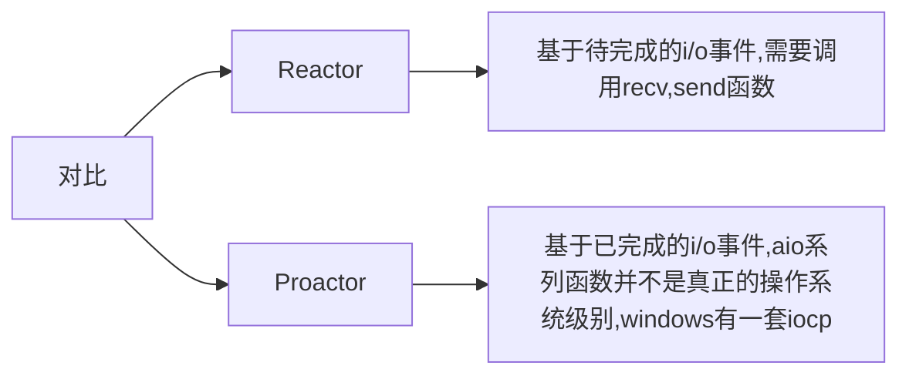
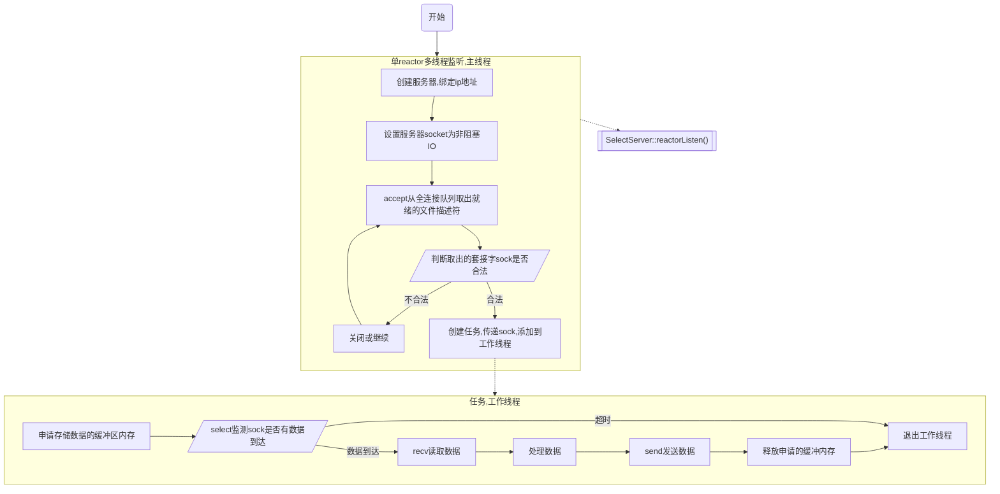
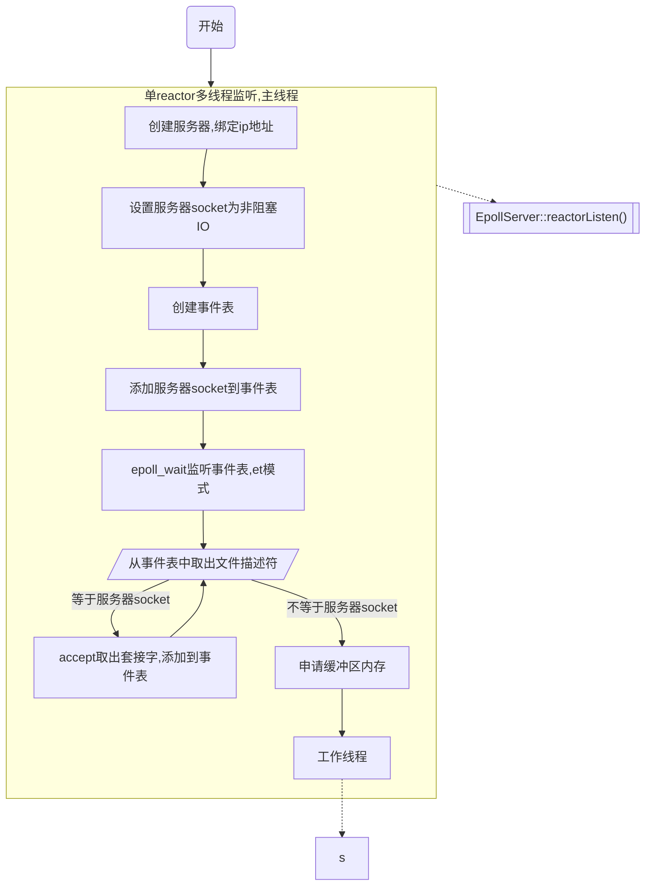

# 1.运行环境
macOS(macbook air M2,   核总数:8（4性能和4能效)
ubuntu20.04(i5-12400, 12核, 18432kb缓存)

# 2.依赖
```bash
glog
```

# 3.编译运行
```bash
mkdir build
cd build
make -j12
./bin/qtserver
```
# 4.程序框架
## 4.1 网络模式


### (1) 单reactor多线程(线程池)
**src/server/selectserver.cpp**


**src/server/epollserver.cpp**



# 代码debug日志
都位于本地回环测试
参考的测试效果：
|测试平台|IO复用方式,程序框架|1客户端的QPS|10客户端的QPS|100客户端的QPS|1000客户端QPS|10000客户端QPS|
|---|---|---|---|---|---|---|
|macOS|select,非阻塞|5763|10544succed 68failed|1711 susceed, 3318 failed.|360 susceed, 4884 failed|---|
1. 非活跃超时时间 5s-->5ms
此时测试的cpu占用情况：
```bash
Load Avg: 11.63, 8.11, 4.81  CPU usage: 2.14% user, 2.86% sys, 94.99% idle
SharedLibs: 720M resident, 156M data, 55M linkedit.
MemRegions: 255827 total, 4835M resident, 357M private, 1990M shared.
PhysMem: 14G used (1577M wired, 885M compressor), 1974M unused.
VM: 225T vsize, 4283M framework vsize, 0(0) swapins, 0(0) swapouts.
Networks: packets: 3598690/1286M in, 3337340/634M out.
Disks: 439003/11G read, 452278/31G written.
```
|测试平台|IO复用方式,程序框架| 非活跃超时时间      | 1个客户端的QPS(每秒请求数量) |10个客户端的QPS | 100个客户端的QPS |
|---|---| -------- | -------- |-------- |-------- |
|macOS|select,reactor非阻塞IO| 5s      |    1    | 1 | 1 |
|macOS|select,reactor非阻塞IO| 5ms   |    80     | 400| 560succeed 60failed |

2. 发现工作线程执行时间为12ms左右，应该为0.1ms左右才算正常
3. **以上两个原因都不是主要的原因, 出问题的地方在于http解析忽略了"connection != keep-alive"的情况，这个时候应该直接结束掉子线程，关闭tcp连接!!!!! 修改完成之后的测试如下**


| 测试平台 | IO复用方式 | 程序框架 | 检测tcp连接非活跃时间 | 1个客户端的QPS | 10个客户端的QPS | 100个客户端的QPS | 1000个客户端的QPS | 10000个客户端的QPS |
| -------- | ---------- | -------- | --------------------- | -------------- | --------------- | ---------------- | ----------------- | -- |
| MacOS        | 非阻塞io,select          | reactor        | 5s                     | 8140              | 9801 susceed, 36 failed               | 2450 susceed, 4064 failed                | 58 susceed, 18382 failed                 |
|ubuntu20.04|非阻塞io,select|reactor|5s|10787|24854|24305|25547|24491|
|ubuntu20.04|非阻塞io,epoll, ET|单线程|5s|28985|54687|53943|54378|72287|

# 调试工具
##  netstat
用于检测服务器是否正常创建
```bash
netstat -an | grep LISTEN

# -a : 显示所有连接和监听端口，包括那些没有连接的。
# -n : 以数字形式显示地址和端口，而不是尝试解析为主机名和服务名
# | : 管道符号, 用于将一个命令的输出作为另一个命令的输入
# grep LISTEN 使用 grep 工具来过滤出包含字符串 "LISTEN" 的行
```

# 性能测试工具

##  webbench
```bash
./webbench -c 1 -t 1 http://127.0.0.1:8080/
# -c : 客户端的数量
# -t : 运行时间，秒
```