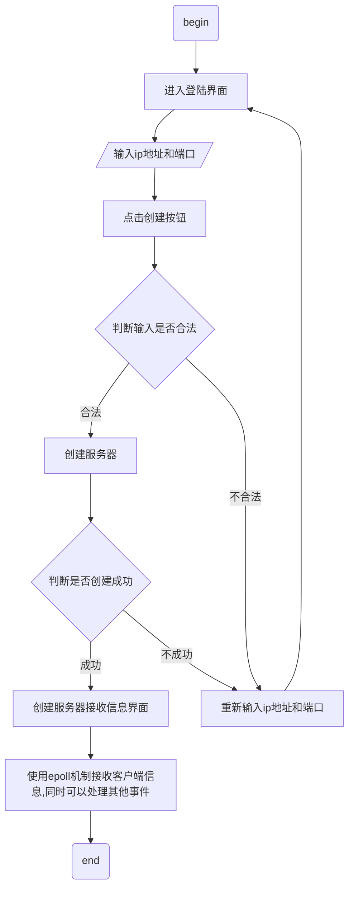
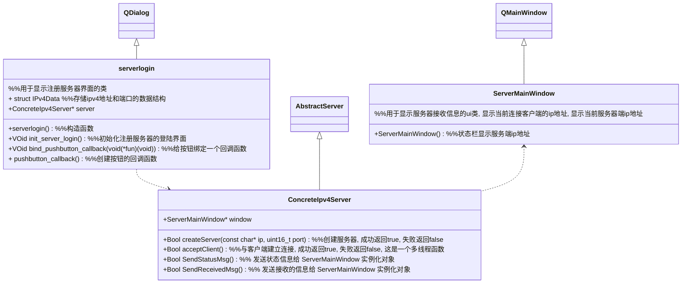
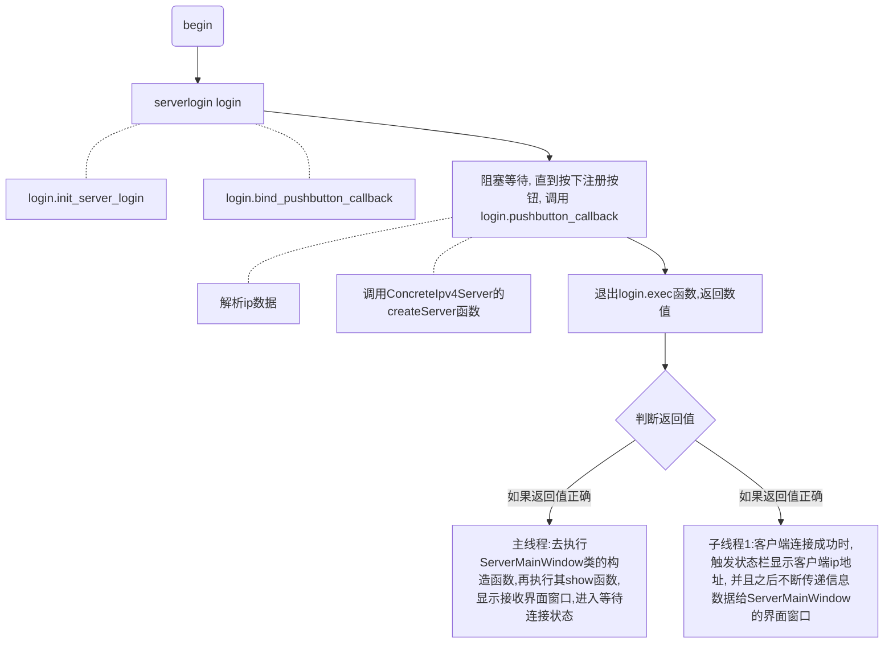

**带QT界面的服务器整体的代码流程图**

```mermaid
graph TB
A(begin)-->B[进入登陆界面]
B-->C[/输入ip地址和端口/]
C-->D[点击创建按钮]
D-->E{判断输入是否合法}
E--合法-->F[创建服务器]
E--不合法-->G[重新输入ip地址和端口]-->B
F-->H{判断是否创建成功}
H--成功-->S[创建服务器接收信息界面]
S-->J
J[使用epoll机制接收客户端信息,同时可以处理其他事件]
H--不成功-->G
J-->L(end)
```

**UML类图**

```mermaid
classDiagram
QDialog <|-- serverlogin

class serverlogin
serverlogin : %%用于显示注册服务器界面的类
serverlogin : +serverlogin() %%构造函数
serverlogin : +VOid init_server_login() %%初始化注册服务器的登陆界面
serverlogin : +VOid bind_pushbutton_callback(void(*fun)(void)) %%给按钮绑定一个回调函数
serverlogin : + struct IPv4Data %%存储ipv4地址和端口的数据结构
serverlogin : + pushbutton_callback() %%创建按钮的回调函数
serverlogin : +ConcreteIpv4Server* server

serverlogin ..> ConcreteIpv4Server

class ConcreteIpv4Server
AbstractServer <|-- ConcreteIpv4Server

ConcreteIpv4Server : +Bool createServer(const char* ip, uint16_t port)%%创建服务器, 成功返回true, 失败返回false
ConcreteIpv4Server : +Bool acceptClient() %%与客户端建立连接, 成功返回true, 失败返回false, 这是一个多线程函数
ConcreteIpv4Server : +Bool SendStatusMsg() %% 发送状态信息给 ServerMainWindow 实例化对象
ConcreteIpv4Server : +Bool SendReceivedMsg() %% 发送接收的信息给 ServerMainWindow 实例化对象
ConcreteIpv4Server : +ServerMainWindow* window

ServerMainWindow <.. ConcreteIpv4Server

class ServerMainWindow
QMainWindow <|-- ServerMainWindow
ServerMainWindow : %%用于显示服务器接收信息的ui类, 显示当前连接客户端的ip地址, 显示当前服务器端ip地址
ServerMainWindow : +ServerMainWindow() %%状态栏显示服务端ip地址
```

```mermaid
graph TB
A(begin)-->B[serverlogin login]-.-B1[login.init_server_login]
B-.-B2[login.bind_pushbutton_callback]
B-->C[阻塞等待, 直到按下注册按钮, 调用 login.pushbutton_callback]
C-.-C0[解析ip数据]
C-.-C1[调用ConcreteIpv4Server的createServer函数]
C-->D[退出login.exec函数,返回数值]
D-->E{判断返回值}
E--如果返回值正确-->F[主线程:去执行ServerMainWindow类的构造函数,再执行其show函数,显示接收界面窗口,进入等待连接状态]
E--如果返回值正确-->G[子线程1:客户端连接成功时,触发状态栏显示客户端ip地址, 并且之后不断传递信息数据给ServerMainWindow的界面窗口]

```