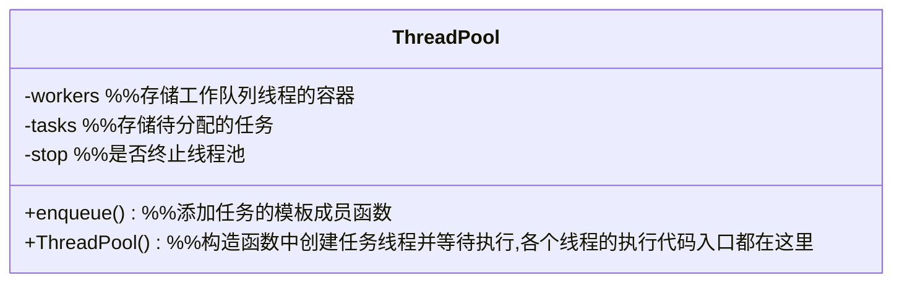
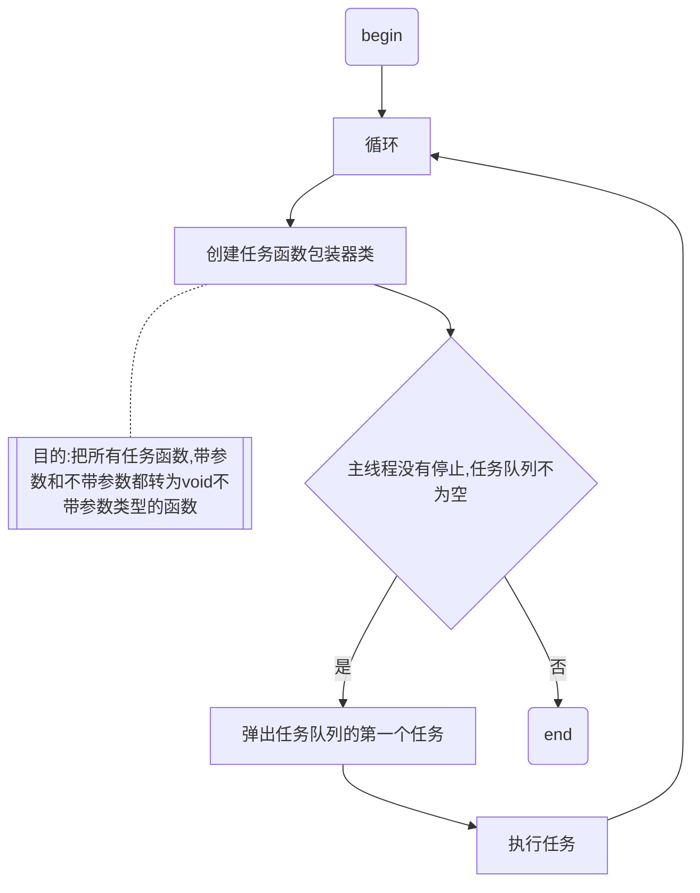
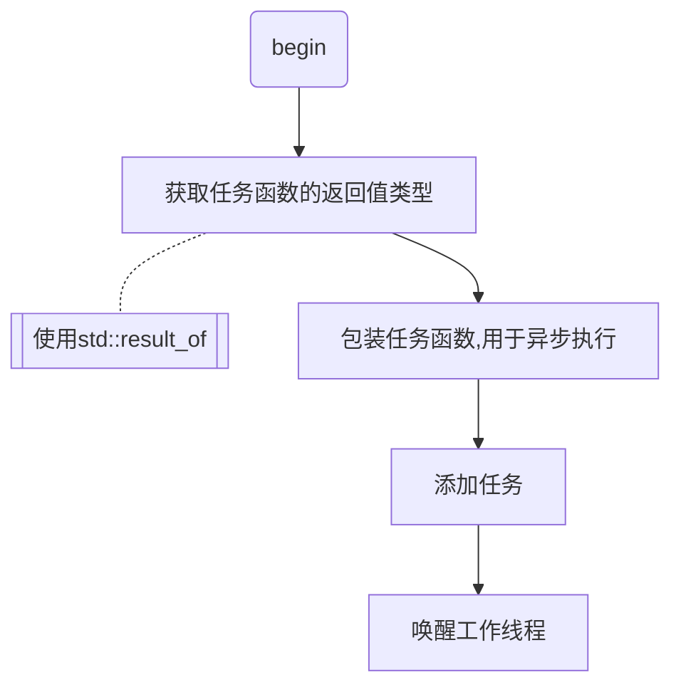

# UML类图

```mermaid
classDiagram
class ThreadPool

ThreadPool : -workers %%存储工作队列线程的容器
ThreadPool : -tasks %%存储待分配的任务
ThreadPool : -stop %%是否终止线程池

ThreadPool : +enqueue() %%添加任务的模板成员函数
ThreadPool : +ThreadPool() %%构造函数中创建任务线程并等待执行,各个线程的执行代码入口都在这里

```

# 任务线程的运行逻辑

```mermaid
graph TB
A(begin)-->B[循环]
B-->C[创建任务函数包装器类]-.-C1[[目的:把所有任务函数,带参数和不带参数都转为void不带参数类型的函数]]
C-->D{主线程没有停止,任务队列不为空}--是-->E[弹出任务队列的第一个任务]
D--否-->F(end)
E-->G[执行任务]
G-->B
```

# 任务添加逻辑

```mermaid
graph TB
A(begin)-->B[获取任务函数的返回值类型]-.-B1[[使用std::result_of]]
B-->C[包装任务函数,用于异步执行]
C-->D[添加任务]
D-->E[唤醒工作线程]
```

