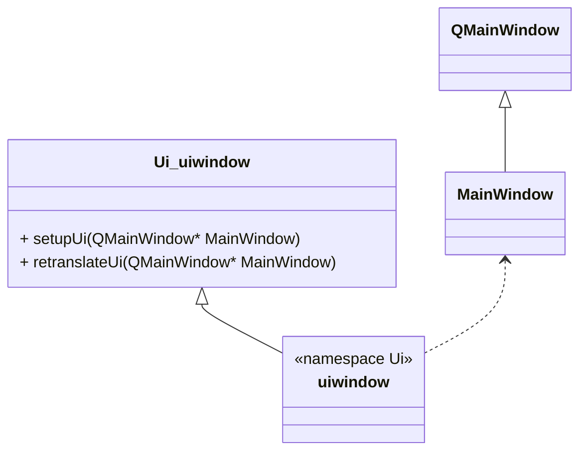
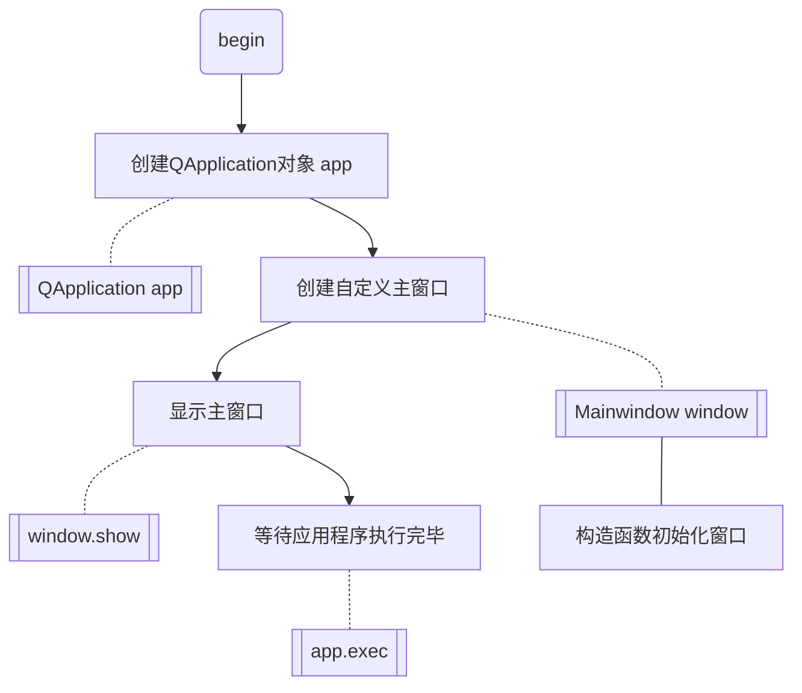
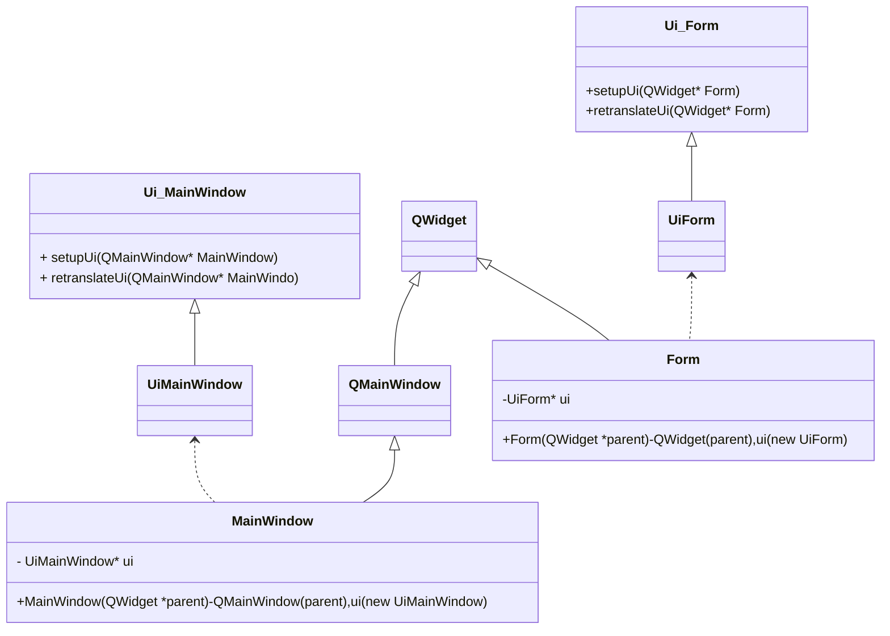

.ui文件转c++代码, 借助qt5的uic工具

**uic 一般在 路径  /usr/lib/x86_64-linux-gnu/qt5/bin/uic**

```bash
uic -o mainwindow_interface.h mainwindow_interface.ui
```
+ uic生成生成的具体类(下); 人创建的具体类(上)




类调用伪代码流程



## 1. 安装 qt creator (只是一个编辑器)
```bash
sudo apt-get install qtcreator
```
## 2. 安装 qt5 (这里可以区分qt4还是qt5)


## 3. qt creator选择对应的qt版本
https://blog.csdn.net/weixin_43577616/article/details/120889646

## 4. qt creator 中 .ui 文件生成 c++ 代码的逻辑关系

## 5. 注意还要去掉 qmake 宏, 不然编译会报 undefined reference to `vtable for ServerLogin 错



**因此, 如果窗口不独立, 本质核心代码在于 Ui_MainWindow 和 Ui_Form 中的 setupUi 函数！这都是由qt creator 中的 uic工具自动生成的！！！**  


# 信号槽

在Qt中，clicked()和clicked(bool)是QPushButton的两个不同的信号。

    clicked(): 这是一个无参数的信号，表示按钮被点击时发出的信号。当按钮被点击时，它会发出clicked()信号，而不提供任何关于按钮状态的信息。

    clicked(bool): 这是一个带有一个布尔参数的信号。当按钮被点击时，它会发出clicked(bool)信号，并将布尔参数设置为true。此外，当按钮被按下（按下鼠标按钮）和释放（释放鼠标按钮）时，也会触发该信号，并将布尔参数设置为true和false。

所以，这两个信号的区别在于clicked(bool)提供了更多关于按钮状态的信息，而clicked()信号仅表示按钮被点击，不提供按钮状态信息。

你可以根据具体的需求选择使用适当的信号。如果你只关心按钮的点击事件而不需要状态信息，使用clicked()信号就足够了。如果你需要了解按钮的状态变化，可以使用clicked(bool)信号。

请注意，不论你选择哪个信号，连接到槽函数的方式都是相同的，使用connect()函数将信号与槽函数进行连接。

#  QStatusBar

